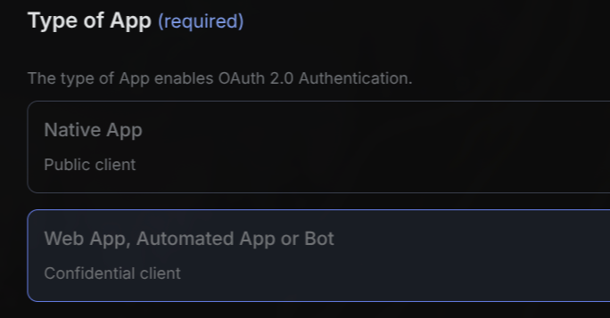

# x-twitter

X (Twitter) automation: post tweets, like/retweet/delete, send DMs, lookup users with connection status and full metrics, mute users, and view blocked accounts. Requires [X Developer account](https://console.x.com/) with credit balance (PAYG) for API usage.

## Voice Triggers

- "Hey Cal, Post a tweet saying hello world"
- "Hey Cal, How many followers does Elon Musk have?"
- "Hey Cal, Send a DM to AbShahzeb saying great work"
- "Hey Cal, Does Sam Altman follow me on X?"
- "Hey Cal, Mute the user @spambot123 on X"
- "Hey Cal, Like the tweet with ID 1234567890"
- "Hey Cal, Show me who I've blocked"

## Required Services

x (twitter)

## Setup

No environment variables required.

### Creating OAuth1/OAuth2 App using X Developer Console

1. Sign in to [X Developer Console](https://console.x.com/)
2. Create a new App. Use any application name, and select `Development` Environment.
3. Copy the `Consumer Key` and `Consumer Secret` when prompted and paste it into the n8n credentials setup for OAuth1.
4. Click on the newly created App and set up User authentication settings:
  
5. Under `App permissions`, select `Read and Write and Direct Messages`.
6. Under `Type of App`, select `Web App, Automated App or Bot`. This enables OAuth2:
  
7. Copy the `Callback URI / Redirect URL` from n8n and paste it into the `Redirect URL` field. I used `http://localhost:5678/rest/oauth1-credential/callback` and got both OAuth1 and OAuth2 working.
8. Paste any valid URL into the `Website URL` field (e.g., `https://github.com`).
9. Copy the `Client ID` and `Client Secret` when prompted and paste it into the n8n credentials setup.

### n8n Credentials

- **TWITTEROAUTH1API_CREDENTIAL** (`twitterOAuth1Api`)
  - n8n credential type: twitterOAuth1Api

- **TWITTEROAUTH2API_CREDENTIAL** (`twitterOAuth2Api`)
  - n8n credential type: twitterOAuth2Api

### Other credentials

- **SELF_USER_ID** (`SELF_USER_ID`)
  - Find your numeric user ID by using the `get_my_user` action in this tool, or use a [third-party web service](https://get-id-x.foundtt.com/en/).

## Installation

### Via CAAL Tools Panel (Recommended)

1. Open CAAL web interface
2. Click Tools panel (wrench icon)
3. Search for "x-twitter"
4. Click Install and follow prompts

### Via Command Line

```bash
curl -s https://raw.githubusercontent.com/CoreWorxLab/caal-tools/main/scripts/install.sh | bash -s x-twitter
```

## Usage

```
X (Twitter) automation tool.

═══════════════════════════════════════════
REQUIRED (always include):
  action (string) — must be exactly one of the values listed below. Do not invent other values.
═══════════════════════════════════════════

--- TWEET INTERACTIONS ---

  action: "get_tweet"
    tweet_id (string, required) — the ID of the tweet to retrieve.
    
    Returns: tweet text, creation date, and full engagement metrics (views, likes, retweets, quote tweets, replies, bookmarks)
    
    WHEN TO USE: When asked about a specific tweet's content, performance, or engagement stats. Examples: "How many likes does tweet X have?", "What does tweet Y say?", "How many views on tweet Z?"

  action: "post_tweet"
    text (string, required) — the tweet content.

  action: "like_tweet"
    tweet_id (string, required) — the ID of the tweet to like.

  action: "unlike_tweet"
    tweet_id (string, required) — the ID of the tweet to unlike.

  action: "retweet_tweet"
    tweet_id (string, required) — the ID of the tweet to retweet.

  action: "unretweet_tweet"
    tweet_id (string, required) — the ID of the tweet to undo a retweet on.

  action: "delete_tweet"
    tweet_id (string, required) — the ID of the tweet to delete. Can only delete your own tweets.

--- USER ACTIONS ---

  action: "dm_user"
    username (string, required) — the recipient's X username/handle without the '@' symbol.
    text (string, required) — the DM content.

  action: "mute_user"
    id (string, required) — the numeric user ID to mute.

  action: "unmute_user"
    id (string, required) — the numeric user ID to unmute.

--- USER LOOKUP ---

These actions retrieve full user profile data. Use them when asked about:
  - follower counts, following counts, tweet counts (public_metrics)
  - whether someone is verified
  - account creation date
  - bio/description, location
  - connection status (are they following you? are you following them? blocking? muting?)
  - whether they accept your DMs
  - pinned tweet ID, most recent tweet ID

  action: "get_user_by_query"
    query (string, required) — a free-text search string (e.g. "elon musk"). Returns the top matching user profile with all metrics.
    
    WHEN TO USE: When the user asks questions like "how many followers does X have?", "is Y verified?", "when did Z join Twitter?", or provides a name/description rather than an exact username.

  action: "get_user_by_username"
    username (string, required) — the exact X username/handle, without the @ symbol. Returns full profile with all metrics.
    
    WHEN TO USE: When you already know the exact username/handle.

  action: "get_my_user"
    (no other fields needed) — returns the authenticated user's own profile with all metrics.
    
    WHEN TO USE: When asked "how many followers do I have?", "what's my bio?", etc.

  action: "get_blocked_users"
    (no other fields needed) — returns a list of all accounts the user has blocked, including their names and usernames.

═══════════════════════════════════════════
RULES:
  - All IDs are strings. Always wrap them in quotes, never send as numbers.
  - "id" is always a numeric user ID. Never a username, never a handle.
  - "tweet_id" is always a numeric tweet ID. Never a URL, never tweet text.
  - "username" must not include the @ symbol.
  - Only include fields that are listed for the action you chose. Do not send extra fields.
  - If you do not have a required ID or tweet_id, do NOT guess or fabricate one. Use get_user_by_query or get_user_by_username first to retrieve it, then use the returned ID in a follow-up request.
  
EXAMPLES:
  Q: "How many followers does Elon Musk have?"
  → Use get_user_by_query with query: "elon musk"
  
  Q: "Can I DM @sama?"
  → Use get_user_by_username with username: "sama"
  
  Q: "Mute @spambot123 on X"
  → First use get_user_by_username with username: "spambot123" to get their ID, then use mute_user with that ID
  
  Q: "What's my follower count?"
  → Use get_my_user
  
  Q: "Does Satya Nadella follow me?"
  → Use get_user_by_query with query: "satya nadella"
  
  Q: "How many likes does tweet 1234567890 have?"
  → Use get_tweet with tweet_id: "1234567890"
  
  Q: "What does my most recent tweet say?"
  → First use get_my_user to get your most_recent_tweet_id, then use get_tweet with that ID

  Q: "DM @Fortnite saying hello world"
  → Use dm_user with username: "Fortnite" and text: "hello world"
═══════════════════════════════════════════
```

## Author

[@AbdulShahzeb](https://github.com/AbdulShahzeb)

## Category

social

## Tags

social, x (twitter)
