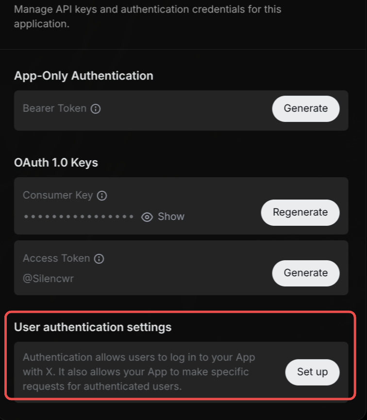

# x-twitter

Post tweets, send direct messages, and search for X users. Requires [X Developer account](https://console.x.com/) with credit balance (PAYG) for API usage.

## Voice Triggers

- "Hey Cal, Post a tweet saying hello world"
- "Hey Cal, Think of a joke and DM it to AbShahzeb on X"
- "Hey Cal, What is @elonmusk's display name on X"

## Required Services

x (twitter)

## Setup

No environment variables required.

### Creating OAuth2 App using X Developer Console

1. Sign in to [X Developer Console](https://console.x.com/)
2. Create a new App. Use any application name, and select `Development` Environment.
3. Click on the newly created App and set up User authentication settings:
  
4. Under `Type of App`, select `Web App, Automated App or Bot`. This enables OAuth2.
5. Copy the `Callback URI / Redirect URL` from n8n and paste it into the `Redirect URL` field.
6. Paste any valid URL into the `Website URL` field (e.g., `https://github.com`).
7. Copy the `Client ID` and `Client Secret` when prompted and paste it into the n8n credentials setup.

### n8n Credentials

- **TWITTEROAUTH2API_CREDENTIAL** (`twitterOAuth2Api`)
  - n8n credential type: twitterOAuth2Api


## Installation

### Via CAAL Tools Panel (Recommended)

1. Open CAAL web interface
2. Click Tools panel (wrench icon)
3. Search for "x-twitter"
4. Click Install and follow prompts

### Via Command Line

```bash
curl -s https://raw.githubusercontent.com/CoreWorxLab/caal-tools/main/scripts/install.sh | bash -s x-twitter
```

## Usage

X (Twitter) tool for posting tweets, sending direct messages, and looking up display names. Actions: 'tweet' posts a tweet (requires text); 'dm' sends a direct message to a user (requires username and text); 'search' retrieves a user's display name from their username - provide a username to search for that user, or leave username empty to get your own display name. Parameters: action (required) - 'tweet', 'dm', or 'search'; text (required for tweet/dm) - the message content; username (required for dm, optional for search) - the X username/handle to look up, leave empty to get your own display name.

## Author

[@AbdulShahzeb](https://github.com/AbdulShahzeb)

## Category

social

## Tags

social, x (twitter)
